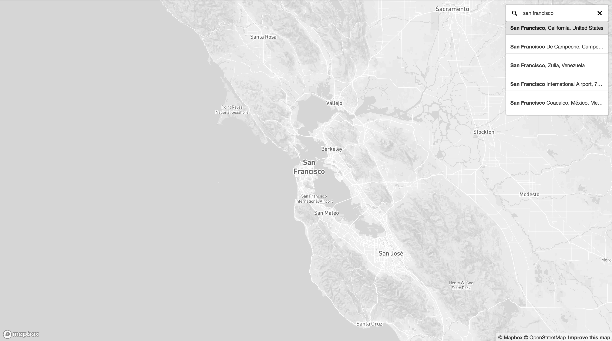

# react-map-gl-geocoder

React wrapper for mapbox-gl-geocoder for use with react-map-gl.

[](https://www.npmjs.com/package/react-map-gl-geocoder)


## Demo

https://codesandbox.io/s/vv29y730q3

## Installation
NPM
```
$ npm install react-map-gl-geocoder
```

or

Yarn
```
$ yarn add react-map-gl-geocoder
```


## Props
  - `mapRef` {Object} Required. 
  - `containerRef` {Object?} This can be used to place the geocoder outside of the map. The `position` prop is ignored if this is passed in. Example: https://codesandbox.io/s/v0m14q5rly
  - `onViewportChange` {Function} Required. 
  - `mapboxApiAccessToken` {String} Required. If not passed in as prop, it will try to default it to value set on `MapboxAccessToken` environment variable or URL query param `?access_token=TOKEN`. See https://uber.github.io/react-map-gl/#/Documentation/getting-started/about-mapbox-tokens for more details.
  - `zoom` {Number} On geocoded result what zoom level should the map animate to when a `bbox` isn't found in the response. If a `bbox` is found the map will fit to the `bbox`. (optional, default `16`)
  - `placeholder` {String} Override the default placeholder attribute value. (optional, default `"Search"`)
  - `proximity` {Object?} a proximity argument: this is
      a geographical point given as an object with latitude and longitude
      properties. Search results closer to this point will be given
      higher priority.
  - `trackProximity` {Boolean} If true, the geocoder proximity will automatically update based on the map view. (optional, default `false`)
  - `bbox` {Array?} a bounding box argument: this is
      a bounding box given as an array in the format [minX, minY, maxX, maxY].
      Search results will be limited to the bounding box.
  - `types` {String?} a comma seperated list of types that filter
      results to match those specified. See <https://www.mapbox.com/developers/api/geocoding/#filter-type>
      for available types.
  - `country` {String?} a comma separated list of country codes to
      limit results to specified country or countries.
  - `minLength` {Number} Minimum number of characters to enter before results are shown. (optional, default `2`)
  - `limit` {Number} Maximum number of results to show. (optional, default `5`)
  - `language` {String?} Specify the language to use for response text and query result weighting. Options are IETF language tags comprised of a mandatory ISO 639-1 language code and optionally one or more IETF subtags for country or script. More than one value can also be specified, separated by commas.
  - `filter` {Function?} A function which accepts a Feature in the [Carmen GeoJSON](https://github.com/mapbox/carmen/blob/master/carmen-geojson.md) format to filter out results from the Geocoding API response before they are included in the suggestions list. Return `true` to keep the item, `false` otherwise.
  - `localGeocoder` {Function?} A function accepting the query string which performs local geocoding to supplement results from the Mapbox Geocoding API. Expected to return an Array of GeoJSON Features in the [Carmen GeoJSON](https://github.com/mapbox/carmen/blob/master/carmen-geojson.md) format.
  - `position` {String} Position on the map to which the geocoder control will be added. Valid values are `"top-left"`, `"top-right"`, `"bottom-left"`, and `"bottom-right"`. (optional, default `"top-right"`)
  - `onInit` {Function} Is passed Mapbox geocoder instance as param and is executed after Mapbox geocoder is initialized
  - `onClear` {Function} Executed when the input is cleared
  - `onLoading` {Function} Is passed `{ query }` as a param and is executed when the geocoder is looking up a query
  - `onResults` {Function} Is passed `{ results }` as a param and is executed when the geocoder returns a response
  - `onResult` {Function} Is passed `{ result }` as a param and is executed when the geocoder input is set
  - `onError` {Function} Is passed `{ error }` as a param and is executed when an error occurs with the geocoder
  
  
  
## Example
```js
import 'mapbox-gl/dist/mapbox-gl.css'
import React, { Component } from 'react'
import MapGL from 'react-map-gl'
import Geocoder from 'react-map-gl-geocoder'

function getAccessToken() {
  var accessToken = null;

  if (typeof window !== 'undefined' && window.location) {
    var match = window.location.search.match(/access_token=([^&\/]*)/);
    accessToken = match && match[1];
  }

  if (!accessToken && typeof process !== 'undefined') {
    // Note: This depends on bundler plugins (e.g. webpack) inmporting environment correctly
    accessToken = accessToken || process.env.MapboxAccessToken; // eslint-disable-line
  }

  return accessToken || null;
}

// Ways to set Mapbox token: https://uber.github.io/react-map-gl/#/Documentation/getting-started/about-mapbox-tokens
const MAPBOX_TOKEN = getAccessToken()

class Example extends Component {
  state = {
    viewport: {
      width: 400,
      height: 400,
      latitude: 37.7577,
      longitude: -122.4376,
      zoom: 8
    }
  }

  mapRef = React.createRef()

  componentDidMount() {
    window.addEventListener('resize', this.resize)
    this.resize()
  }

  componentWillUnmount() {
    window.removeEventListener('resize', this.resize)
  }

  resize = () => {
    this.handleViewportChange({
      width: window.innerWidth,
      height: window.innerHeight
    })
  }

  handleViewportChange = (viewport) => {
    this.setState({
      viewport: { ...this.state.viewport, ...viewport }
    })
  }

  // if you are happy with Geocoder default settings, you can just use handleViewportChange directly
  handleGeocoderViewportChange = (viewport) => {
    const geocoderDefaultOverrides = { transitionDuration: 1000 }

    return this.handleViewportChange({
      ...viewport,
      ...geocoderDefaultOverrides
    })
  }

  render() {
    return (
      <MapGL
        ref={this.mapRef}
        {...this.state.viewport}
        onViewportChange={this.handleViewportChange}
        mapboxApiAccessToken={MAPBOX_TOKEN}>
        <Geocoder
          mapRef={this.mapRef}
          onViewportChange={this.handleGeocoderViewportChange}
          mapboxApiAccessToken={MAPBOX_TOKEN}
        />
      </MapGL>
    )
  }
}

export default Example

```


